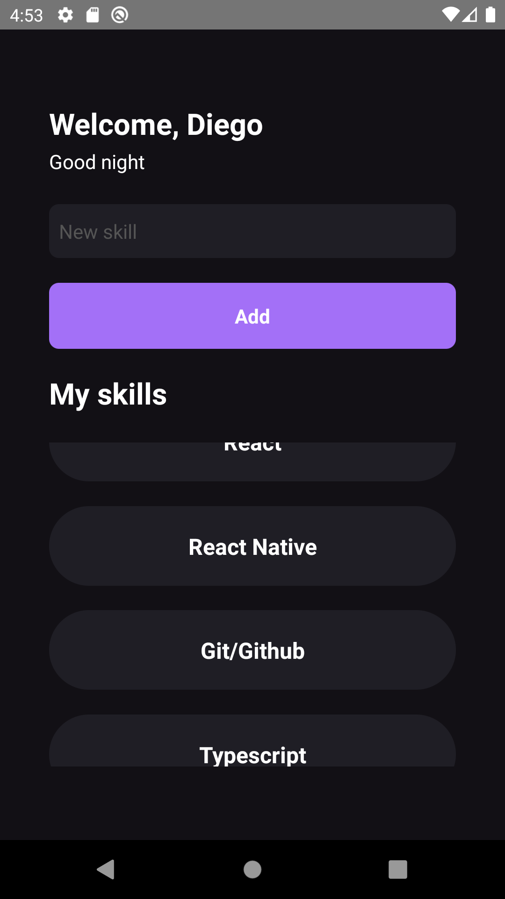

# My Skills

## 📱 Showcase



## 📄 Description

A React Native application to display your skills as you input them.

## 💻 Project

MySkills is a project developed during Chapter I from Rocketseat Ignite bootcamp

## 🧪 Technologies

- [React Native](https://www.reactnative.dev)
- [TypeScript](https://www.typescriptlang.org/)

## 🚀 Getting started

Clone the project and access its directory

```bash
git clone https://github.com/DiegoCstBraga/mySkillsApp.git
cd mySkillsApp
```

> To run the project, first you need to setup your environment for React Native. If you don't > know how to do so, click [here](https://reactnative.dev/docs/environment-setup).

If your environment is already set up, here is the following steps:

```bash
# Install all dependencies
yarn

# Start the project
yarn start
```
